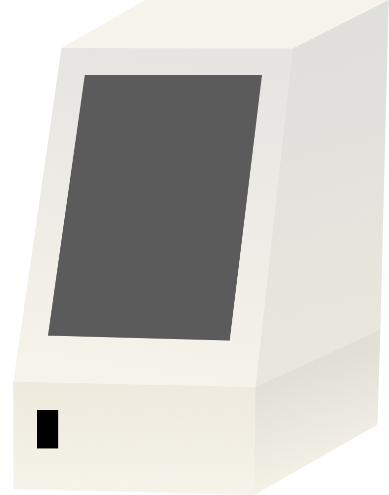
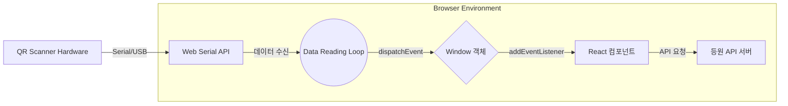

<div align="center">



# jmedu-kiosk

제이엠에듀 등하원 키오스크 인터페이스

    

</div>

## ✨ 소개

**jmedu-kiosk**는 QR 스캐너와 터치 디스플레이를 활용해 간편하게 등하원 처리를 할 수 있는 웹 기반 키오스크 인터페이스 입니다.

## 🖥️ 타겟 하드웨어

- **Raspberry Pi 5**
- **GROW GM65** QR 스캐너
- **1024×600** 터치 디스플레이
- **3D 프린팅** 하우징

## 🚀 기술 스택

- **Typescript** / **React**
- **Zod** - 데이터 검증
- **Zustand** - 상태 관리
- **Vite** - 번들러

## 🏗️ 아키텍쳐 다이어그램



## ⚙️ 환경 설정

키오스크의 실행 환경에 맞게 **APP_CONFIG**를 구성해야 합니다.

- **개발(빌드 전):** `/public/config.js`
- **배포(빌드 후):** `/config.js`

<!-- prettier-ignore-start -->
```js
window.APP_CONFIG = {  
  API_URL: "http://192.168.1.1:8100",     // 등원 API 서버 URL
  API_TIMEOUT_MILLISECONDS: 3000,         // API 응답 타임아웃(밀리초)
  API_CHECK_INTERVAL_MILLISECONDS: 15000, // API 확인 간격(밀리초)
  WIDTH: 600,                             // 가로 해상도
  HEIGHT: 1024,                           // 세로 해상도
  IS_SCREEN_ROTATE: false,                // 화면 회전 여부
  THEME: "light",                         // "light" or "dark"
  RESULT_COUNTDOWN_SECONDS: 3,            // 결과 화면 카운트다운(초)
};
```
<!-- prettier-ignore-end -->
